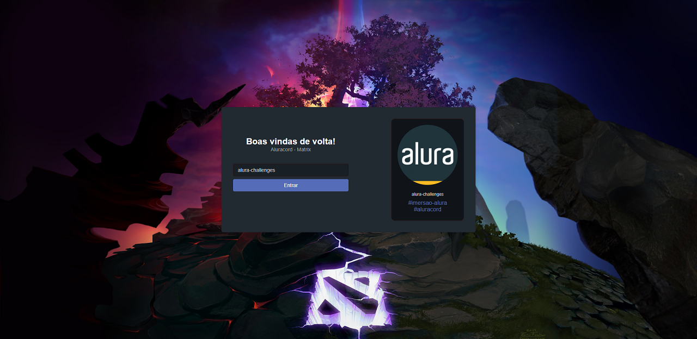
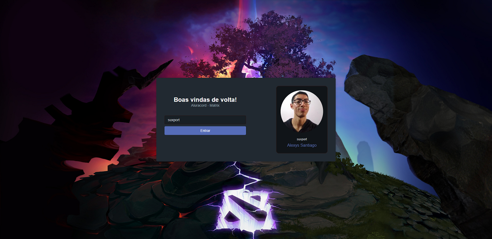
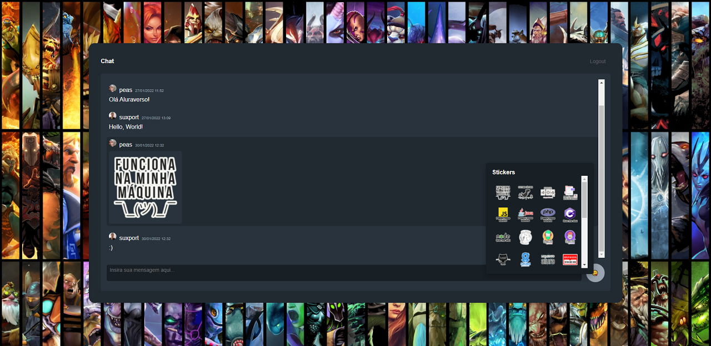

# Imersão React 4 - Aluracord

Mergulhando em React e ampliando o meu portfólio com a [Alura](https://www.alura.com.br/imersao-react).

Link do app: https://aluracord-matrix-ruddy.vercel.app/

Repositório original: [Aluracord Base](https://github.com/alura-challenges/aluracord-matrix)

## Resultados

### Página inicial

### Página com o perfil do GitHub

### Página de chat

